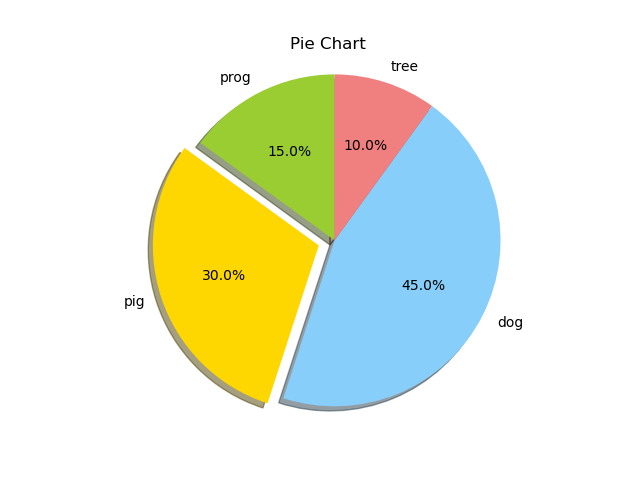
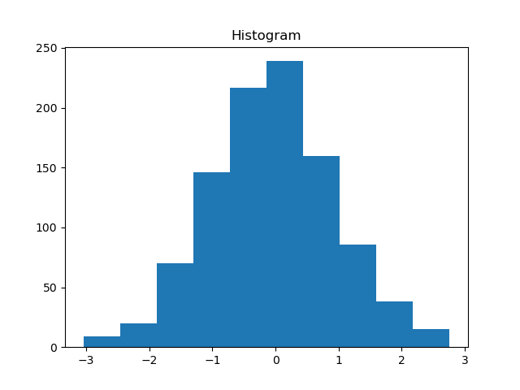
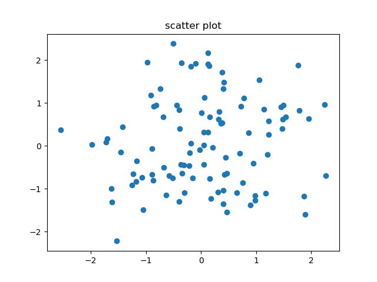

# matplotlib

## 기본 명령어

> 기본 세팅

```python
import matplotlib as mpl
import matplotlib.pyplot as plt
```

> 한글 폰트 사용 (파이참), 폰트 다운로드 사이트:[https://hangeul.naver.com/2017/nanum](https://hangeul.naver.com/2017/nanum)

```python
import matplotlib.font_manager as fm
path = 'C:/NanumBarunGothic.ttf'		# 다운로드 필요
fontprop = fm.FontProperties(fname=path, size=10) 

# 이후 한글 폰트를 적용하고자 하는 곳에 fontproperties=fontprop 입력
```

> 기본 명령어(순서는 가능하면 지키는게 좋음)

```python
plt.figure(figsize=(10, 2))
```

```python
# 제목 설정
plt.title('제목 예시', fontproperties=fontprop)
```

```python
# 그래프 그리기 및 특성 설정
plt.plot(x, y, c='b', lw=5, ls='--', marker='o', ms=15, mec='g', mew=5, mfc='r')

plt.plot(x, y, 'bo--', label='aa')	
plt.plot(x, y, 'rs--', label='bb')	# 추가 그래프 그리기

# DataFrame plot
df.plot()
df.plot(kind='barh', grid=True, figsize=(12, 8)) 	# 다양한 설정 가능
```

```python
# 축 값 설정
plt.xlim(0, 50)				# x 축 최솟값~최댓값 설정	
plt.ylim(0, 20)				# y 축 최솟값~최댓값 설정
plt.xticks([0, 20, 50])		# x 축 최솟값, 중간 격자, 최댓값 선택
plt.yticks([0, 5, 10, 20])	# y 축 최솟값, 중간 격자, 최댓값 선택
```

```python
# 범례 표시
plt.xlabel('xlabel')	# x 값 라벨 설정
plt.ylabel('ylabel')	# y 값 라벨 설정
plt.legend(loc=1)		# 그래프 범례 표시(plot에 label이 설정되어 있어야함)
```

```python
# 이미지 저장
plt.savefig(f'path/image_name.png', 	# 저장 경로 및 파일이름, 확장자 설정
            dpi=100, 					# dpi(해상도) 설정
            facecolor='#eeeeee', 		# 배경색 설정 (기본 흰색)
            edgecolor='blue')			# 테두리색 설정 (기본 흰색)
```

```python
# 플롯 보이기
plt.grid()	# 격자 표시
plt.colorbar() # 칼라 바 표시
plt.show()	# 윈도우 보이기

# 자동으로 닫고 싶을 경우
plt.show(block=False)
plt.pause(2)	# 시간 지연
plt.close()
```

> 특성 표

| 색 명령어 | 의미    | 마커명령어 | 의미           | 스타일명령어 | 의미     |
| --------- | ------- | ---------- | -------------- | ------------ | -------- |
| `b`       | blue    | `.`        | point marker   | `-`          | soild    |
| `g`       | green   | `,`        | pixwl          | `--`         | dashed   |
| `r`       | red     | `o`        | circle         | `-.`         | dash-dot |
| `c`       | cyan    | `v`        | triangle_down  | `:`          | dotted   |
| `m`       | magenta | `^`        | triangle_up    |              |          |
| `y`       | yellow  | `<`        | triangle_left  |              |          |
| `k`       | black   | `>`        | triangle_right |              |          |
| `w`       | white   | `1`        | tri_down       |              |          |
|           |         | `2`        | tri_up         |              |          |
|           |         | `3`        | tri_left       |              |          |
|           |         | `4`        | tri_right      |              |          |
|           |         | `s`        | square         |              |          |
|           |         | `p`        | pentagon       |              |          |
|           |         | `*`        | star           |              |          |
|           |         | `h`        | hexagon1       |              |          |
|           |         | `H`        | hexagon2       |              |          |
|           |         | `+`        | plus           |              |          |
|           |         | `x`        | x              |              |          |
|           |         | `D`        | diamond        |              |          |
|           |         | `d`        | thin_diamond   |              |          |

[matplotlib.org](https://matplotlib.org/stable/gallery/index.html)

>  서브플롯 기본 구조

```python
plt.subplot(2, 1, 1)		# 2 X 1 에서 1 의 위치
# 이후 기본 구성 입력
plt.title() ~ plt.grid()
```

```python
plt.subplot(2, 1, 2)		# 2 X 1 에서 2 의 위치
# 이후 기본 구성 입력
plt.title() ~ plt.grid()
```

```python
plt.tight_layout()		# 각 서브플롯의 레이아웃이 겹치지 않게 조정
plt.show()
```

> 서브플롯 다른 표현방법 > 이 방식으로 반복문 설정 가능

```python
fig, axes = plt.subplot(2, 2)

# 각 위치별 구성 입력
axes[0, 0].plot(x, y) ...
axes[0, 1].set_title('sub title') ...
axes[1, 0].grid() ...
axes[1, 1].plot() ...

plt.tight_layout()
plt.show()
```

## 다양한 플롯

```python
# bar chart
x = [0, 1, 2]
y = [200, 300, 100]
plt.bar(x, y)
plt.show()
```


```python
plt.barh(x, y)
plt.show()
```


```python
# pie chart
sizes = [15, 30, 45, 10]
explode = (0, 0.1, 0, 0)  # 간격 여부
labels = ['prog', 'pig', 'dog', 'tree']
colors = ['yellowgreen', 'gold', 'lightskyblue', 'lightcoral']

plt.title("Pie Chart")
plt.pie(sizes, explode=explode, labels=labels, colors=colors,
        autopct='%1.1f%%', shadow=True, startangle=90)
plt.axis('equal')
plt.savefig('pie_chart.png')
plt.show(block=False)
plt.pause(2)
plt.close()
```



```python
# histogram
np.random.seed(0)
x = np.random.randn(1000)
plt.title("Histogram")
arrays, bins, patches = plt.hist(x, bins=10)    # x 축의 값을 일정한 간격으로 나눔

plt.savefig('histogram.png')
plt.show(block=False)
plt.pause(2)
plt.close()
```



```python
# scatter
np.random.seed(0)
x = np.random.normal(0, 1, 100)
y = np.random.normal(0, 1, 100)
plt.title('scatter plot')
plt.scatter(x, y)
plt.show()
```



```python
plt.boxplot([x1, y1, x2, y2],
            labels=['x1_label', 'y1_label', 'x2_label', 'y2_label'])
```

